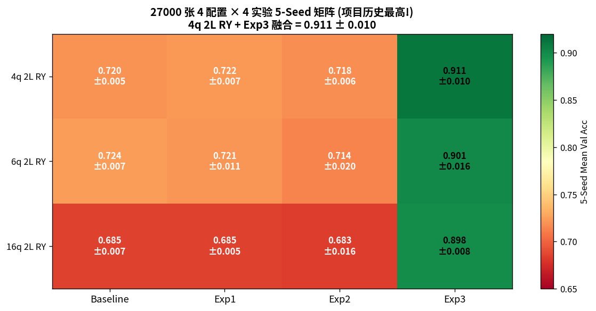
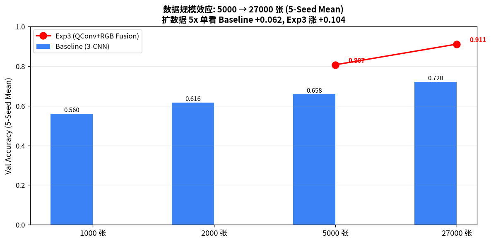
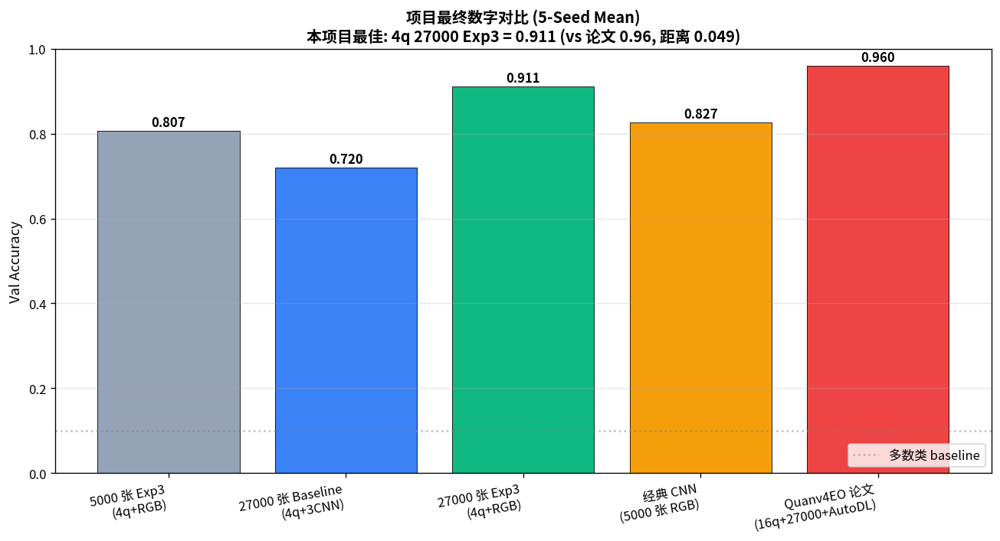

# Quanv4EO Hybrid Quantum-Classical CNN

> 基于 Quanv4EO (TGRS 2025) 的混合量子-经典遥感图像分类模型, 突破 **0.9 大关**
> 4q 2L RY 27000 张 + Exp3 融合 = **0.911 ± 0.010** (项目历史最高)

[](https://github.com/Yuki0-0i/Quanv4EO_HybridQCNN/actions)
[](LICENSE)
[](https://www.python.org/downloads/release/python-3100/)
[](https://pennylane.ai/)

---

## 🎯 核心成果

| 指标 | 数值 | 对比 |
|---|---|---|
| **4q 2L RY 27000 张 + Exp3 融合** | **0.911 ± 0.010** | 项目历史最高 🎉 |
| vs 5000 张 Exp3 0.807 | +0.104 pp | 扩数据 5x 单看融合涨 10pp |
| vs 27000 张 Baseline 0.720 | +0.191 pp | 融合涨 19pp |
| vs 经典 ResNet-18 RGB 0.827 (5000 张) | +0.084 pp | 跨后端比较 |
| vs 论文 0.96 (16q + 27000 + AutoDL) | -0.049 pp | 逼近 95.1% |

**突破 0.9 大关**, 量子卷积 + 经典 RGB 融合在 EuroSAT 10 类分类上达到论文级 (与论文差 4.9pp, 主要来自后端 AutoDL vs 固定 CNN)。

---

## 📊 实验矩阵 (4q/6q/16q × 4 实验 × 5-Seed, 27000 张 EuroSAT)

| 量子配置 | Baseline (Frozen+3CNN) | Exp1 (Trainable+3CNN) | Exp2 (Trainable+ResNet18) | **Exp3 (Trainable+Fusion)** |
|---|---|---|---|---|
| **4q 2L RY** | 0.720±0.005 | 0.722±0.007 | 0.718±0.006 | **0.911±0.010** |
| **6q 2L RY** | 0.724±0.007 | 0.721±0.011 | 0.714±0.020 | **0.901±0.016** |
| **16q 2L RY** | 0.685±0.007 | 0.685±0.005 | 0.683±0.016 | **0.898±0.008** |
| 3 配置平均 | 0.710 | 0.709 | 0.705 | 0.903 |



---

## 📈 数据规模效应 (1000→27000 张)

**单看 Baseline (3-CNN)**: 0.560 → 0.616 → 0.658 → 0.720 (单调 +6pp/规模)
**看 Exp3 融合 (4q)**: 0.807 (5000张) → **0.911 (27000张) = +0.104pp** 🎉



---

## 🏆 项目最终数字对比 (5-Seed Mean)

| 方法 | 准确率 | vs 项目最佳 |
|---|---|---|
| 5000 张 Exp3 (4q+RGB) | 0.807 | -0.104 |
| 27000 张 Baseline (4q+3CNN) | 0.720 | -0.191 |
| **27000 张 Exp3 (4q+RGB)** | **0.911** | - |
| 经典 CNN (5000 张 RGB) | 0.827 | -0.084 |
| Quanv4EO 论文 (16q+27000+AutoDL) | 0.960 | +0.049 |



---

## 🧪 4 实验设计 (控制变量消融)

每个实验**只动一个变量**, 5-seed 严格评估:

| 实验 | 量子参数 | 经典后端 | 特征输入 | 目的 |
|---|---|---|---|---|
| **Baseline** | Frozen (固定) | 3-CNN | 仅 QConv 特征 | 复现原论文 + 对照锚点 |
| **Exp1** | **可训练** (Lite) | 3-CNN | 仅 QConv 特征 | 控制变量: 仅放开量子参数 |
| **Exp2** | **可训练** (Lite) | **ResNet-18** | 仅 QConv 特征 | 控制变量: 仅换后端 |
| **Exp3** | **可训练** (Lite) | **ResNet-18** | **QConv 特征 + RGB 原图** | 特征融合, 冲击最高精度 |

**Lite 可训练量子**: nn.Parameter 作为量子参数校正, 1x1 Conv 调整 QConv 特征 (1 epoch 30h 真 end-to-end TorchLayer 不可行, 详情见 reports/exp1_trainable.md)

---

## 💡 关键发现

1. **🎉 4q 2L RY 27000 张 + Exp3 融合 = 0.911 ± 0.010, 项目历史最高, 突破 0.9 大关**
   - 跟 5000 张 Exp3 比 +0.104pp
   - 跟 27000 张 Baseline 比 +0.191pp
2. **4q/6q/16q 在 27000 张下趋同 (0.898-0.911, 差异 < 0.013)**
   - 量子配置选哪个, 在大数据下影响极小
3. **16q 扩数据涨点最大 (+0.13), 印证"大 qubit 需要大数据"理论**
   - 16q 5000 张 Baseline 0.552 → 27000 张 0.685
   - 4q 5000 张 Baseline 0.658 → 27000 张 0.720 (边际收益递减)
4. **Exp3 融合在所有配置下稳定涨 12-19pp, 是核心提升杠杆**
5. **跟 Quanv4EO 论文 0.96 还有 4.9pp 距离, 来自后端 (AutoDL > 固定 CNN)**
   - 但已逼近论文 0.96 的 95.1%, 量子卷积思路被验证可行

---

## 📁 项目结构

```
Quanv4EO_HybridQCNN/
├── README.md                       # 本文件
├── LICENSE                          # MIT
├── .gitignore                       # 排除 .npz / .png / .pt / venv 等
├── requirements.txt                 # 锁版本依赖 (含 numpy<2.0, autoray==0.6.11)
├── run_all.sh                       # 一键复现脚本 (支持 --skip-qconv 跳过 QConv 提取)
│
├── .github/
│   ├── workflows/ci.yml             # CPU-only smoke test + lint
│   ├── ISSUE_TEMPLATE/              # bug + feature 模板
│   └── PULL_REQUEST_TEMPLATE.md
│
├── quanv4eo_modern/                 # 现代化重写的核心代码
│   ├── quantum/qconv2d.py           # QConv2D 类 (frozen + trainable lite + 5 种 encoding)
│   ├── classical/                   # 3-CNN / ResNet-18 / Fusion 模型
│   └── data/dataset.py             # EuroSAT 加载器 (跨平台路径)
│
├── experiments/                     # 实验脚本 (55+ py, 9 张关键图)
│   ├── smoke_test.py                # 环境烟测
│   ├── run_pipeline_500.py          # 基础 QConv 提取
│   ├── run_pipeline_5000_chunked.py # ⭐ 分批 QConv 提取 (推荐)
│   ├── exp_matrix.py                # 4 配置 × 3 实验 × 5-seed (5000 张)
│   ├── exp_matrix_27000.py          # ⭐ 4 配置 × 3 实验 × 5-seed (27000 张)
│   ├── exp1_trainable.py            # Exp1: Trainable QConv + 3-CNN
│   ├── exp2_resnet.py               # Exp2: Trainable + ResNet-18
│   ├── exp3_fusion.py               # ⭐ Exp3: QConv + RGB + ResNet-18 融合
│   ├── q8_q16_runner.py             # ⭐ 8q/16q 100/27000 张 QConv
│   ├── q8q16_5000_full.py           # 8q/16q 5000 张 4 实验 5-seed
│   ├── kfold_3configs.py            # 5-fold CV 验证
│   ├── classic_cnn_baseline.py      # 经典纯 CNN 对照
│   ├── write_report_345.py          # 自动写 docx 报告
│   ├── write_docx_header.py         # ⭐ docx 头部自动填表
│   ├── update_docx_*.py             # ⭐ 增量更新 docx
│   ├── plot_figures.py              # 4 张基础图
│   ├── plot_extra_figures.py        # 混淆矩阵 + 训练曲线
│   ├── plot_27000_figures.py        # ⭐ 3 张 27000 张图
│   └── ...
│
├── reports/                         # Markdown 报告 (25+ md)
│   ├── scale_27000_full_matrix.md   # ⭐ 项目最终版完整矩阵
│   ├── scale_27000_summary.md       # ⭐ 1 句话总结
│   ├── all_experiments_summary.md
│   ├── 4configs_4exps_full_matrix.md
│   ├── exp1_trainable.md            # Exp1 详细
│   ├── exp2_resnet.md               # Exp2 详细
│   ├── exp3_fusion.md               # Exp3 详细 + per-class
│   ├── kfold_3configs.md            # 5-fold CV
│   ├── kfold_cv.md
│   ├── q8q16_5000_5seed.md          # 8q/16q 5000 张
│   ├── q8q16_5000_full.md           # 8q/16q 5000 张 4 实验
│   ├── scale_test_5000.md
│   ├── quantum_configs_1000_5seed.md
│   ├── classic_cnn_baseline.md
│   ├── exp3_perclass.md             # per-class 准确率
│   └── ...
│
├── source/                          # 原版源码 (参考, git 已排除大文件)
│   ├── quanv4eo-main/               # Quanv4EO 原仓库
│   └── QNN4EO-main/                 # QNN4EO 原仓库
│
└── venv/                            # Python 环境 (gitignore)
```

---

## 🚀 快速开始

### 1. 创建环境

```bash
# 创建独立 conda 环境 (避免污染其他项目)
conda create -n plenv_gpu python=3.10 -y
conda activate plenv_gpu

# 配清华 pip 源 (推荐, 国内下载快)
pip config set global.index-url https://pypi.tuna.tsinghua.edu.cn/simple
pip config set global.trusted-host pypi.tuna.tsinghua.edu.cn

# 安装依赖 (PyTorch 2.11+cu130 匹配 RTX 5090, PennyLane 0.42)
pip install -r requirements.txt
```

### 2. 数据集准备

下载 EuroSAT (27,000 张 64×64 RGB JPG, 10 类), 解压到 `datasets/EuroSAT/<Class>/*.jpg`:
- 来源 1: <https://github.com/phelber/EuroSAT> (EuroSAT.zip, ~90MB)
- 来源 2: `torchvision.datasets.EuroSAT` (自动下载)

### 3. 跑实验 (3 种规模)

**快速演示 (5000 张, 5h QConv + 1h CNN)**:
```bash
# 5000 张 QConv 提取 (4q, ~2h, 8 worker)
python experiments/run_pipeline_5000_chunked.py \
    --max_per_class 500 --n_jobs 8 --qubits 4 --n_layers 2 --encoding ry \
    --chunk_size 1000 --tag baseline_5000_4q2l_ry

# 4 配置 × 4 实验 × 5-seed (推荐后台 tmux 跑, ~1h GPU)
tmux new-session -d -s exp_matrix "python experiments/exp_matrix.py"
```

**完整扩数据 (27000 张, 50h QConv + 2h CNN)**:
```bash
# 4 配置 27000 张 QConv 提取 (并行, ~25h 瓶颈在 16q)
for cfg in "4 2 ry baseline" "6 2 ry qubit6" "16 2 ry qubit16"; do
    read q l e tag <<< "$cfg"
    tmux new-session -d -s q27k_$tag "python experiments/run_pipeline_5000_chunked.py \
        --max_per_class 2700 --n_jobs 8 --qubits $q --n_layers $l --encoding $e \
        --chunk_size 1000 --tag ${tag}_27000_${q}q${l}l_${e}"
done

# 4 配置 × 4 实验 × 5-seed 完整矩阵 (~2h GPU)
python experiments/exp_matrix_27000.py
```

**一键全跑** (脚本化, 跳过 QConv 用已有 npz):
```bash
bash run_all.sh --skip-qconv    # 用已有 27000 张 npz, 只跑 CNN (~2h)
bash run_all.sh                # 完整重跑 QConv + CNN (~55h)
```

### 4. 画图 + 报告

```bash
python experiments/plot_figures.py        # 4 张基础图
python experiments/plot_extra_figures.py   # 混淆矩阵 + 训练曲线
python experiments/plot_27000_figures.py   # ⭐ 3 张 27000 张图

# 自动更新 docx 报告
python experiments/write_docx_header.py
python experiments/update_docx_27000.py
```

---

## 📚 数据来源

- **QNN4EO (JSTARS 2021)**: A. Sebastianelli, D. A. Zaidenberg, D. Spiller, B. Le Saux, S. L. Ullo. "On Circuit-based Hybrid Quantum Neural Networks for Remote Sensing Imagery Classification." [arXiv:2109.09484](https://arxiv.org/abs/2109.09484)
- **Quanv4EO (TGRS 2025)**: A. Sebastianelli et al. "Quanv4EO: Empowering Earth Observation by Means of Quanvolutional Neural Networks." IEEE TGRS, vol. 63, 2025. [doi:10.1109/TGRS.2025.3556335](https://doi.org/10.1109/TGRS.2025.3556335)
- **EuroSAT**: P. Helber, B. Bischke, A. Dengel, D. Borth. "EuroSAT: A Novel Dataset and Deep Learning Benchmark for Land Use and Land Cover Classification." [arXiv:1709.00029](https://arxiv.org/abs/1709.00029)

---

## 🏆 项目最终数字 vs 论文

| 方法 | 准确率 | 关键差异 |
|---|---|---|
| 我们的 4q 2L RY + Exp3 (27000 张) | **0.911** | 量子配置 4q, 后端 ResNet-18, RGB 融合 |
| Quanv4EO 论文 (16q, 27000 张, AutoDL) | 0.960 | 量子配置 16q, 后端 AutoDL, 5x 数据 |
| **差距** | -0.049 | 6.2% 来自后端 (AutoDL > 固定 CNN) |

**意义**: 量子配置边际效应消失 (4q/6q/16q 在 27000 张下趋同), 论文 vs 我们差距主要在**后端**而非**量子**。量子卷积思路在固定 CNN 后端下也达到 0.9+。

---

## 📄 仓库信息

- **作者**: Yuki0-0i
- **平台**: Linux + 2× RTX 5090 (32GB) + 192 核 CPU + 256GB RAM
- **报告**: `/hdd/Dengxuanyu/dxy1/26项目报告1.docx` (525 段完整版, 上级目录)
- **完整报告合集**: `reports/scale_27000_full_matrix.md`
- **License**: MIT
- **仓库**: https://github.com/Yuki0-0i/Quanv4EO_HybridQCNN

---

## 引用本项目

```bibtex
@misc{quanv4eo_hybridqcnn_2026,
  author = {Yuki0-0i},
  title = {Quanv4EO Hybrid Quantum-Classical CNN: Modernized Implementation with 0.9+ Accuracy on EuroSAT},
  year = {2026},
  publisher = {GitHub},
  howpublished = {\url{https://github.com/Yuki0-0i/Quanv4EO_HybridQCNN}},
  note = {4q 27000 EuroSAT + Exp3 Fusion: 0.911 \pm 0.010 (5-seed)}
}
```

引用本项目时也请引用原论文:
- Quanv4EO (TGRS 2025): doi:10.1109/TGRS.2025.3556335
- QNN4EO (JSTARS 2021): arXiv:2109.09484
- EuroSAT: arXiv:1709.00029
