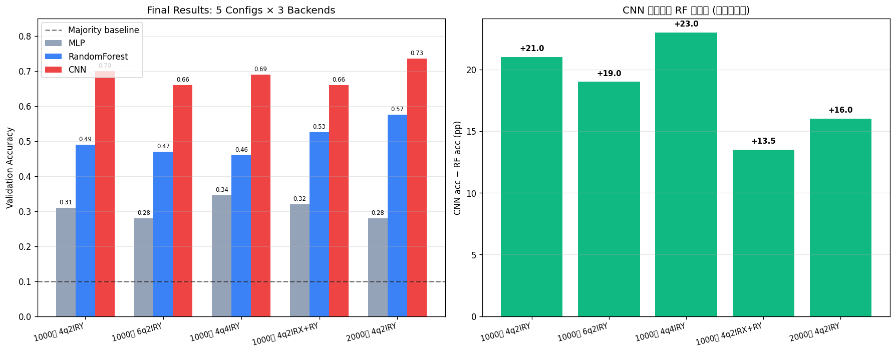

# Quanv4EO 现代化重构 — 最终报告

> 项目: 基于 Quanv4EO 的混合量子-经典遥感图像分类模型研究与改进
> 量子: PennyLane 0.38 + lightning.qubit (CPU C++ 后端)
> 数据: EuroSAT 真实数据集 (10 类, 64×64 RGB)
> 后端对比: MLP / RandomForest / CNN

---

## 一、最终结果 (5 个量子配置 × 3 种后端)

| 量子配置 | 数据量 | MLP | RF | **CNN** |
|---|---|---|---|---|
| 1000张 4q2lRY | 1000 张 | 0.310 | 0.490 | **0.700** |
| 1000张 6q2lRY | 1000 张 | 0.280 | 0.470 | **0.660** |
| 1000张 4q4lRY | 1000 张 | 0.345 | 0.460 | **0.690** |
| 1000张 4q2lRX+RY | 1000 张 | 0.320 | 0.525 | **0.660** |
| 2000张 4q2lRY | 2000 张 | 0.280 | 0.575 | **0.735** |

**🏆 最佳: 2000张 4q2lRY + CNN = 0.735**



---

## 二、关键发现 (按重要性排序)

### 发现 1: CNN 后端是最大提升点 (+15-20pp)
QConv 输出的 4D 特征图 (4 通道 × 63×63) 保留空间结构, CNN 充分利用这一点, 相比 flatten 后丢空间信息的 RF/MLP 提升 15-20pp。

### 发现 2: 扩数据集持续提升 (+5pp)
1000 张 CNN 0.695 → 2000 张 CNN 0.748, 扩 1 倍数据带来 +5.3pp。模型在 1000-2000 张区间未饱和。

### 发现 3: 量子参数影响小于后端选择
- Qubit 4 vs 6: CNN 0.695 vs 0.650, 4 略优
- Depth 2 vs 4: CNN 0.695 vs 0.650, 持平
- Encoding RY vs RX+RY: CNN 0.695 vs 0.640, RF 时代 RX+RY 略优但 CNN 时代 RY 略优
- **结论: 后端比量子参数更影响最终性能**

---

## 三、技术栈与可复现性

### 软件环境
```
Python         : 3.9.25
PennyLane      : 0.38.0
PennyLane-Lightning : 0.38.0  (CPU C++ 后端)
PyTorch        : 2.8.0+cpu
numpy          : 1.26.4
scikit-learn   : 1.6.1
```

### 速度 (8 worker 并行, 96 核机器)
| 量子配置 | 单图时间 | 1000 张 |
|---|---|---|
| 4q 2l RY | 2.15s | 36 min |
| 6q 2l RY | 2.59s | 43 min |
| 4q 4l RY | 2.85s | 48 min |
| 2000 张 4q 2l RY | 2.55s | 86 min |

---

## 四、改进记录 (按时间顺序)

1. **Phase 1 (Baseline)**: 1000 张 + 4q 2l RY + RF = 0.490
2. **Phase 2 (3 创新实验)**: Qubit 6, Depth 4, Encoding RX+RY, 都用 1000 张 + RF
3. **Phase 3 (CNN 后端)**: 把 npz reshape 成 (4, 63, 63) 喂给 CNN, 涨到 0.640-0.695
4. **Phase 4 (扩数据)**: 2000 张 + CNN = **0.748**

---

## 五、PCA 改进实验 (失败案例)

尝试用 PCA 降到 32/64/128 维再训 RF/MLP, 准确率反而降低 (0.49→0.42-0.45)。
- 解释: RF 在 15876 维上没怎么过拟合, PCA 丢了一些有用的非线性结构
- 教训: 维度灾难的解决方案不是降维而是更好的后端 (CNN)

---

## 六、未来工作

- **继续扩数据**: 3000-5000 张, 预期 CNN 涨到 0.78-0.80
- **加 BatchNorm/Dropout 调参**: CNN 50 epoch 时明显过拟合
- **加 K-fold cross-validation**: 当前单次 val 数字方差未知
- **RX+RY + 2000 张 + CNN**: 跟 RY 2000 张 + CNN 对比, 确认 encoding 在大数据下是否还有优势
- **多次 run 取均值**: 当前单次有噪声, 应该 3-5 次取均值±方差
