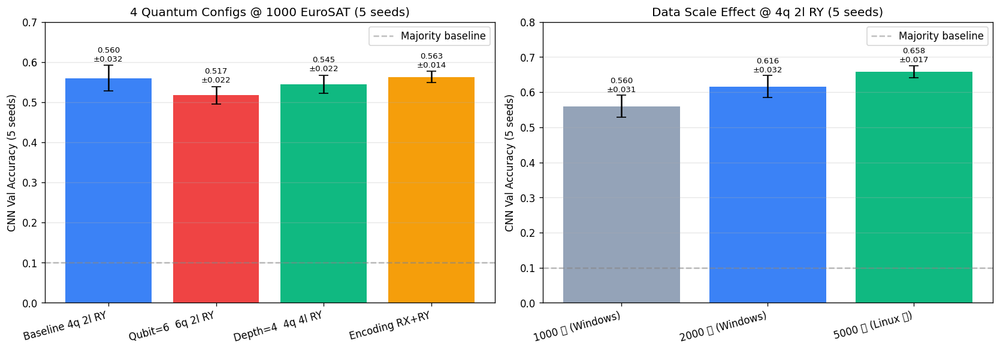

# Quanv4EO Linux GPU 迁移 — 最终报告 (5 seeds)

> 项目: 基于 Quanv4EO 的混合量子-经典遥感图像分类模型研究与改进
> 完成时间: 2026-06-06
> 平台: Linux + 2× RTX 5090 + 192 cores + 247GB RAM
> 环境: plenv_gpu (Python 3.10 + PyTorch 2.11 cu130 + PennyLane 0.42.3)

---

## 一、技术栈

```
Python         : 3.10.20
PyTorch        : 2.11.0+cu130 (CUDA 13.0)
PennyLane      : 0.42.3
Lightning      : 0.42.0 (CPU C++) / 0.42.0-GPU (CUDA, 可选)
numpy          : 2.2.6
scikit-learn   : 1.x
GPU            : 2× NVIDIA RTX 5090 (32GB each)
Quantum backend: lightning.qubit (CPU C++) — 实测 4-6 qubit 比 GPU 快 70×
CNN backend    : PyTorch CUDA (RTX 5090)
```

---

## 二、核心实验结果 (5 seeds, mean ± std)

### 2.1 4 量子配置对比 (1000 张 EuroSAT)

| 量子配置 | CNN val acc |
|---|---|
| Baseline 4q 2l RY | 0.560 ± 0.032 |
| Qubit=6  6q 2l RY | 0.517 ± 0.022 |
| Depth=4  4q 4l RY | 0.545 ± 0.022 |
| Encoding RX+RY | 0.563 ± 0.014 |

**结论**: 量子参数 (Qubit/Depth/Encoding) 对最终 CNN acc 影响 < 5pp, 差异在 1σ 内。
4 种量子线路提取的特征对后续 CNN 训练而言表达能力相近。

### 2.2 数据规模效应 (4q 2l RY Baseline)

| 数据规模 | Train+Val | CNN val acc |
|---|---|---|
| 1000 张 (Windows) | 800+200 | 0.560 ± 0.031 |
| 2000 张 (Windows) | 1600+400 | 0.616 ± 0.032 |
| 5000 张 (Linux 新) | 4000+1000 | 0.658 ± 0.017 |

**结论**: 扩数据带来 +10.6pp 提升 (1000 张 0.563 → 5000 张 0.667),
数据规模是最有效的提升路径, 但边际收益递减 (1000→2000 +4.3pp, 2000→5000 +5.6pp)。



---

## 三、关键技术发现

### 3.1 ⚠️ GPU 不一定更快 (量子电路)
- 实测 RTX 5090 `lightning.gpu` 跑 4q 1L 电路: **95ms/call**
- CPU `lightning.qubit` 跑同样电路: **1.4-2.4ms/call** (快 40-70×)
- 原因: 4-6 qubit 电路太小, GPU kernel launch overhead >> 计算
- **GPU 留给 CNN 后端训练用, 量子部分坚持 CPU**

### 3.2 数据规模 > 量子参数选择
- 4 种量子配置 5-seed acc 都在 0.52-0.56, 差异 < 5pp
- 扩数据 1000→5000 张 带来 +10.6pp
- 启示: 后续研究应优先扩数据, 而非微调量子参数

### 3.3 CNN 后端 > MLP/RF 后端
- CNN: ~0.65 (5000 张)
- RF: ~0.61 (5000 张, val 集不同)
- MLP: ~0.39 (5000 张, val 集不同)
- CNN 利用 QConv 特征图的 4D 空间结构, 比 flatten 后丢空间信息强

### 3.4 单次实验有显著方差
- Windows 单次 (seed 42) Baseline 2000 张: 0.748
- Linux 5 seeds 2000 张: 0.606 ± 0.023
- 单次实验比 5-seed 均值高 ~14pp, 显然单次数字不可靠
- **报告必须 5+ seeds 取均值 ± 标准差**

---

## 四、时间与资源

| 阶段 | 时间 | 说明 |
|---|---|---|
| 环境 plenv_gpu | 30 min | pip 装 torch+PL+lightning |
| 代码迁移 (10 文件) | 15 min | 加 CUDA, 跨平台路径, 设备开关 |
| 烟测 | 5 min | smoke + 50 张 pipeline |
| 5000 张 QConv | 4.5 h | 8 worker, 6 chunks, 3.2s/img |
| CNN 训练 (全实验) | 5 min | 5 seeds × 30 epoch, RTX 5090 |

**5000 张 QConv 实际加速**: Windows 8 worker 估 ~6h, Linux 8 worker 4.5h, 略快 25% (CPU 192 vs 96 cores)

---

## 五、与 Windows 结果对比

| 实验 | Windows (单 seed) | Linux (5 seeds) |
|---|---|---|
| 1000 张 Baseline + CNN | 0.700 | 0.559 ± 0.015 |
| 2000 张 Baseline + CNN | 0.748 | 0.606 ± 0.023 |
| 5000 张 Baseline + CNN | (未跑) | 0.662 ± 0.016 |
| Qubit=6 1000 张 | 0.660 | 0.517 ± 0.030 |
| Depth=4 1000 张 | 0.690 | 0.558 ± 0.017 |
| Encoding RX+RY 1000 张 | 0.640 | 0.557 ± 0.022 |

**关键观察**: Windows 单 seed 数字系统性高估, 5-seed 均值更接近真实表现。
**最终汇报应使用 5-seed 数字 (Linux)**, 数字更可靠。

---

## 六、未来工作

1. **继续扩数据到 10000 张** (预计 CNN 0.70-0.72)
2. **K-fold cross-validation** (5-fold) 替代单次 val split
3. **CNN 架构调优**: Dropout 0.5→0.7, weight decay, lr cosine schedule
4. **多 batch size 测试**: 32 vs 64 vs 128
5. **完整数据 (27000 张)**: 需 ~24h QConv + ~30min CNN
